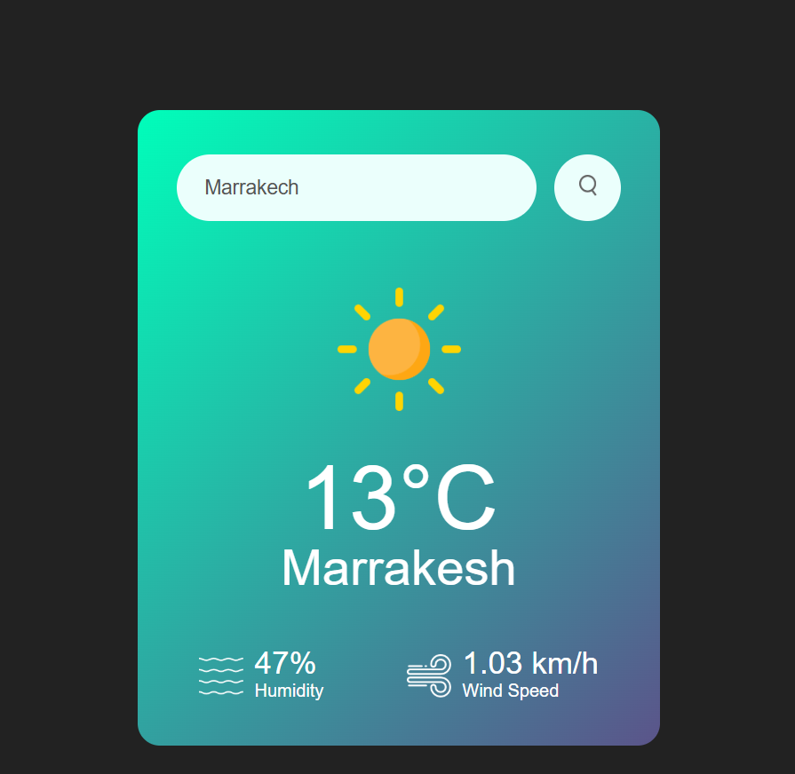

# Weather App

## Description
This is a simple Weather App that allows users to search for the current weather conditions of a city by entering its name. The app fetches data from the OpenWeatherMap API and displays details such as:

- Temperature
- Humidity
- Wind speed
- Weather conditions with an appropriate icon

The app includes a user-friendly interface and supports dynamic error handling if an invalid city name is entered.

---

## Features

1. **Real-time Weather Information:**
   - Displays temperature, humidity, wind speed, and weather condition.

2. **Dynamic Icons:**
   - Updates the weather icon based on the condition (e.g., Clear, Clouds, Rain, etc.).

3. **Error Handling:**
   - Shows an error message if the user enters an invalid city name.

4. **Modern Design:**
   - A clean and responsive UI styled with CSS.

---

## Interface Preview




---

## Technologies Used

1. **HTML** - For structuring the app.
2. **CSS** - For styling the app.
3. **JavaScript** - For fetching and displaying weather data dynamically.
4. **OpenWeatherMap API** - To retrieve weather data.

---

## Files in the Project

1. **index.html**: The main HTML file containing the structure of the app.
2. **style.css**: The CSS file for styling the app.
3. **images/**: A folder containing all the icons used in the app (e.g., search button, weather icons, etc.).
4. **script.js**: (Inline in this case) JavaScript code for API calls and app logic.

---

## How to Run the App

1. Clone this repository to your local machine:
   ```bash
   git clone https://github.com/yourusername/weather-app.git
   ```

2. Navigate to the project folder:
   ```bash
   cd weather-app
   ```

3. Open the `index.html` file in your browser:
   ```bash
   start index.html
   ```
   Alternatively, you can use the Live Server extension in VS Code for better development experience.

---

## API Key Setup

1. Sign up for a free API key on [OpenWeatherMap](https://openweathermap.org/).
2. Replace the placeholder API key in the JavaScript file:
   ```javascript
   const apiKey = "your_actual_api_key";
   ```

---

## Future Enhancements

1. Add support for multiple languages.
2. Implement a five-day weather forecast feature.
3. Improve UI/UX with animations and transitions.
4. Add geolocation support to detect the user's current location.

---

## License

This project is licensed under the MIT License. You are free to use, modify, and distribute this application as per the license terms.

---

## Credits

- Weather data powered by [OpenWeatherMap](https://openweathermap.org/).
- Icons sourced from the `images` folder in this project.
- Built with love by [Your Name].

---

## Thank You!

Thank you for taking the time to explore my Weather App. This project showcases my ability to build interactive and visually appealing web applications. Your feedback and interest in my work are greatly appreciated!

If you have any questions or would like to discuss further, feel free to reach out via :
- **LinkedIn**: [ouissal farih](https://www.linkedin.com/in/ouissal-farih/)
  or
- **Email**: [ouissal.farih@gmail.com](mailto:ouissal.farih@gmail.com)
Looking forward to connecting!

